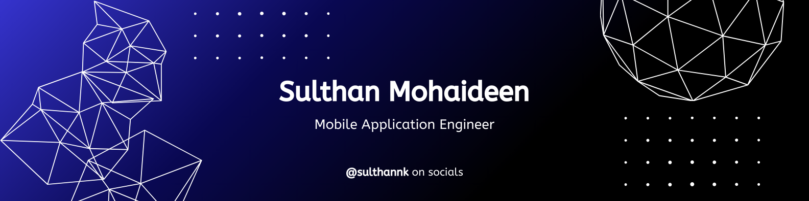

-----------------------------------------------------------------------------------------------------------------------------------------------------------------------

### 🤔 About
- **Working:** Building mobile apps with React Native & sometimes Flutter too! 💻 If I get too bored, you’ll find me wandering around Next.js for some web magic. 😎 
- **Learning:** Currently exploring Kotlin with Compose Multiplatform (maybe it’ll help my native Android game 🤷‍♂️). Also tinkering with open-source management! 🔥  
- **Hobbies:** Reading books 📚 | Listening to podcasts 🎧 | Snapping surprise shots with my lens peek [here](https://www.instagram.com/the_casual_click) 📸  
- **Fun Fact:** While most developers swear by coffee 😅, I’m loyal to tea! ❤️  
- **Ask Me About:** Absolutely anything! I’m always happy to help. ✌️  
- **Pronouns:** He/Him 🙂

  

-----------------------------------------------------------------------------------------------------------------------------------------------------------------------

### ✨ Visitors count

  

<!--

-----------------------------------------------------------------------------------------------------------------------------------------------------------------------

### 📈 Some stats

  

  

-----------------------------------------------------------------------------------------------------------------------------------------------------------------------

### 🔧 Tools in my belt

  

-->
  
-----------------------------------------------------------------------------------------------------------------------------------------------------------------------

### 🌐 Let’s Connect

  
  
  
  

<em><b>I love connecting with different people</b> so if you want to say <b>Hi 👋, I'll be happy to meet you more!</b> :)</em>

-----------------------------------------------------------------------------------------------------------------------------------------------------------------------
